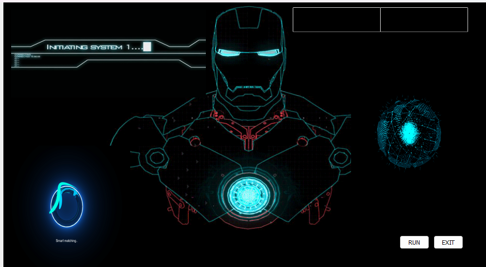
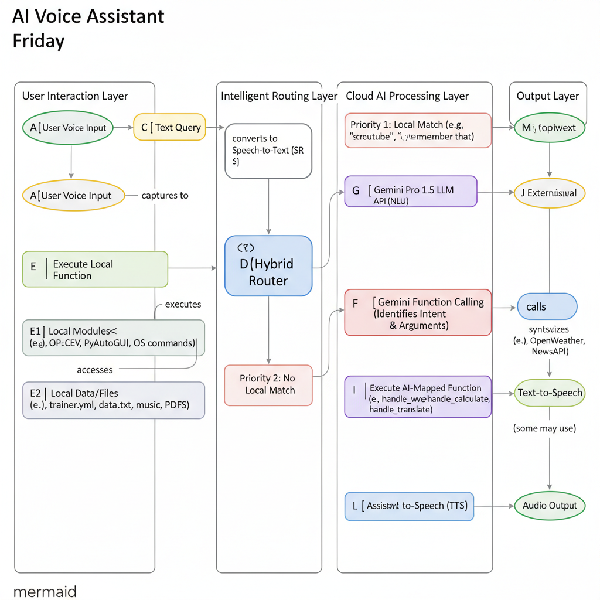

# Friday - A Hybrid AI Voice Assistant

## 🚀 Project Summary

***Friday*** is an advanced, end-to-end voice assistant application designed for desktop environments. It leverages a sophisticated **hybrid routing system** that intelligently combines local machine learning for user verification, a rules-based local command handler for speed and efficiency, and a powerful cloud-based Large Language Model (Google Gemini) for complex natural language understanding and task execution. This architecture ensures a fast, reliable, and intelligent user experience without solely relying on external APIs.

The project demonstrates key concepts in machine learning, system design, and **API** integration, making it a comprehensive showcase of modern AI application development.

## ✨ Key Features

- **Real-time Face Verification:** Secures assistant activation using a locally trained ML model.
- **Hybrid Command Routing:** Optimizes performance and **API** usage by prioritizing local command execution.
- **Natural Language Understanding (**NLU**):** Utilizes Google Gemini for advanced conversational capabilities and function calling.
- **Desktop Automation:** Performs various system-level tasks (screenshots, volume control, app opening).
- **Web Integration:** Seamlessly opens websites and performs searches on YouTube, Google, Wikipedia, and WikiHow.
- **Personal Productivity:** Includes features for time, battery status, internet speed, calculations, unit conversions, translations, and memory recall.
- **Informational Queries:** Provides weather updates and news headlines.
- **Entertainment:** Plays local music and tells jokes.

## 🧠 End-to-End ML Architecture Explained

*Friday* is not just a single model; it's an intelligent **system of interconnected components** that work together to deliver a seamless user experience. Here's a breakdown of its end-to-end machine learning pipeline:

### 1. The Core ML Model: Real-time Face Verification

- **Problem:** Ensure secure and personalized activation of the voice assistant.
- **Data Collection:** Custom `dataset.py` script captures multiple facial images for a specific user.
- **Model Training:** An ****LBPH** Face Recognizer** (Local Binary Patterns Histograms) is trained on the collected dataset. This model learns the unique textural patterns and features of the authorized user's face.
- **Model Integration (Deployment):** The trained model (`trainer.yml`) is loaded by the `detect()` function at startup. It continuously processes real-time camera input to verify the user's identity before the assistant fully activates, providing a robust security layer.

### 2. The Logic Model: Hybrid Intent Router

- **Problem:** Mitigate **API** latency and quota limitations while ensuring fast responses for common tasks.
- **Solution:** A custom, **rules-based intent router** is implemented within the `MainThread`'s `run` method, utilizing a `local_command_map`. This acts as the first line of defense for processing user commands.
- **The Pipeline:**
    1.  User speech is converted to text.
    2.  The text query is first checked against a predefined list of local keywords and patterns (e.g., *youtube*, *screenshot*, *open code*, *remember that*).
    3.  **If a local match is found**, the corresponding Python function (e.g., `handle_youtube_local`, `handle_screenshot`, `handle_open_app`) is executed directly. This process is instant, uses no **API** quota, and ensures high responsiveness for frequently used commands.
    4.  **Only if no local command is matched**, the query proceeds to the next stage (the AI Brain).

### 3. The NLU Model: AI-as-a-Service (Google Gemini)

- **Problem:** Understand complex, nuanced, and unscripted natural language requests that require advanced reasoning or external data.
- **Solution:** Integration with the **Google Gemini Pro 1.5 Large Language Model** via its **API**. Gemini acts as an intelligent Natural Language Understanding (**NLU**) service.
- **Integration (Function Calling):**
    1.  The user's query is sent to the Gemini **API**.
    2.  Gemini, using its *Function Calling* capabilities, analyzes the query to determine the user's intent and extracts relevant arguments.
    3.  It then proposes calling one of the predefined Python functions (e.g., `handle_weather`, `handle_calculate`, `handle_translate`) with the correctly parsed arguments.
    4.  The system executes the suggested function with the AI-provided parameters. This allows for highly flexible and conversational interactions that go beyond simple keyword matching.

---

## 📐 System Diagram

This diagram illustrates the flow of commands through the hybrid architecture:

## The entire system is designed to be smart and efficient. It works by *routing* your commands to the right place, ensuring that simple, fast commands don't use your limited AI quota.

## 1.User Interaction Layer

This is the starting point.

User Voice Input: You speak a command (e.g., *Friday, screenshot*).

Speech-to-Text (SR): The speech_recognition library listens to your voice and converts it into plain text (*friday, screenshot*).

## 2.Intelligent Routing Layer

This is the brain of the operation and the most important part of the design.

Hybrid Router: The text query goes to your run method, which acts as a router.

Priority 1: Local Match: The router first checks if the query starts with a known local command from your local_command_map (like *screenshot*, *youtube*, *open gmail*, etc.).

Priority 2: No Local Match: If the command is not in the local map (like *what's the weather in London?*), the router decides it must be a job for the AI.

## 3.Processing Layers (The Two Paths)

Based on the router's decision, the query takes one of two completely different paths:

Path A: Local Processing Layer (Fast & Free) Execute Local Function: If a local match was found (e.g., *screenshot*), the router directly calls your handle_screenshot_local() function.

Local Modules & Data: This function uses local libraries (like pyautogui) and local files (like trainer.yml or data.txt) to get the job done instantly.

This path uses 0 **API** calls.

Path B: Cloud AI Processing Layer (Smart & Quota-Based) Send to Gemini **API**: The router sends the full text query (*Friday, what's the weather in London?*) to the Google Gemini **LLM**.

Gemini Function Calling: The AI analyzes the sentence and figures out the user's intent. It determines, "This user wants to run the handle_weather function, and the city parameter is London."

Execute AI-Mapped Function: The system then calls your handle_weather(city=*London*) function. This function might use its own external APIs (like OpenWeather) to get the data.

This path uses 1 **API** call.

## 4.Output Layer

Both paths must end up at the same place to give you a response.

Assistant Response (Text): Both the local function (handle_screenshot_local) and the AI-mapped function (handle_weather) return a simple text string (e.g., *Screenshot saved* or *The weather in London is...*).

Text-to-Speech (**TTS**): This final text response is fed into the pyttsx3 engine (speak() function).

Audio Output: The assistant speaks the response to you.

---

## 🛠️ Technologies Used

- **Python 3.x**
- **Speech Recognition:** `SpeechRecognition` library (Google Speech Recognition **API**)
- **Text-to-Speech:** `pyttsx3` (Windows **SAPI5**)
- **Face Recognition:** `OpenCV`, `Pillow`, `NumPy` (for **LBPH** training and detection)
- **Large Language Model:** Google Gemini **API** (for advanced **NLU** and function calling)
- **Web Automation:** `webbrowser`, `pywhatkit`, `wikipedia`, `wikihow`
- **System Control:** `os`, `psutil`, `pyscreenshot`, `pyautogui`, `speedtest-cli`
- ****GUI**:** `PyQt5` (for the animated UI)
- **Utility:** `datetime`, `operator`, `pyjokes`
- **Packaging:** `PyInstaller`

---

## ⚙️ Setup and Installation

### 1. Clone the repository:

'''bash git clone [https://github.com/YourGitHubUsername/Friday-AI-Assistant.git](https://github.com/YourGitHubUsername/Friday-AI-Assistant.git) cd Friday-AI-Assistant ## Create a virtual environment (recommended): Bash

python -m venv venv .\venv\Scripts\activate  # On Windows source venv/bin/activate # On macOS/Linux ## Install dependencies: (First, create a requirements.txt file by running pip freeze > requirements.txt in your project's terminal)

Bash

pip install -r requirements.txt ## Configure API Keys and Paths: Create a config.py file in the root directory and add your **API** keys and local file paths:

Python

# config.py

GEMINI_API_KEY = *YOUR_GEMINI_API_KEY* WEATHER_API_KEY = *YOUR_OPENWEATHER_API_KEY* NEWS_API_KEY = *YOUR_NEWSAPI_KEY*

# Get your Gemini API key from [https://ai.google.dev/](https://ai.google.dev/)

# Get your OpenWeather API key from [https://openweathermap.org/](https://openweathermap.org/) # Get your NewsAPI key from [https://newsapi.org/](https://newsapi.org/)

 
-Train the Face Recognition Model: Before running, you need to train the face recognition model with your face. (You will need to create these helper scripts, dataset.py and trainer.py)

-Run dataset.py: This script will capture images of your face. Follow the on-screen instructions.

-Run trainer.py: This script will train the **LBPH** model and save trainer.yml.

## Run the Assistant:

Bash

-python main.py 🚀 Deployment (Packaging for Distribution) To create a standalone executable (e.g., .exe for Windows) that can run without a Python installation:

## Install PyInstaller:

Bash

pip install pyinstaller ## Run PyInstaller in your project's root directory: You will need to explicitly tell PyInstaller to include all non-Python files (GIFs, trainer.yml, .xml files). Adjust paths as necessary.

Bash

pyinstaller --onefile --windowed \
    --add-data=*path/to/gif1.gif;.* \
    --add-data=*path/to/gif2.gif;.* \
    --add-data=*path/to/gif3.gif;.* \
    --add-data=*path/to/gif4.gif;.* \
    --add-data=*trainer/trainer.yml;trainer* \
    --add-data=*haarcascade_frontalface_default.xml;.* \
    --hidden-import=*pyttsx3.drivers.sapi5* \
    --hidden-import=*google.generativeai* \
    main.py
The --add-data=*source;destination* flag is crucial. The example above assumes trainer.yml is in a trainer folder and the gifs are at the paths you specify.

The final executable will be in the dist/ directory.'''

## 🤝 Contributing

Contributions, issues, and feature requests are welcome! Feel free to check the issues page.

## 📄 License

This project is licensed under the **MIT** License - see the **LICENSE** file for details.

## 🙏 Acknowledgments

The developers of Python and its amazing ecosystem of libraries.

Google Gemini for powerful **NLU** capabilities.

The open-source community for countless resources and inspiration.
